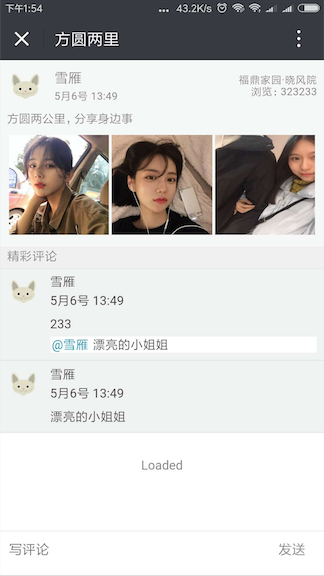
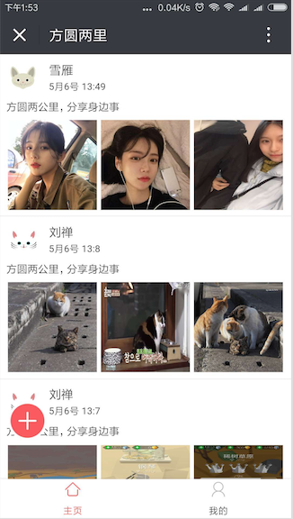
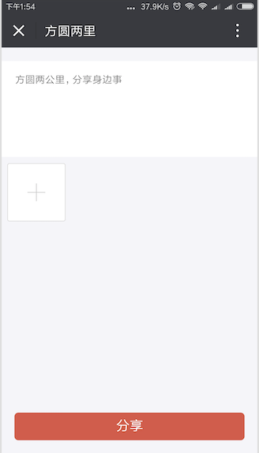
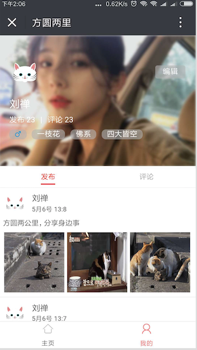
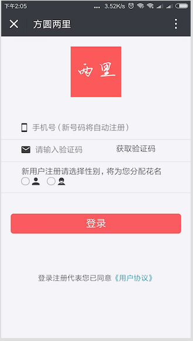
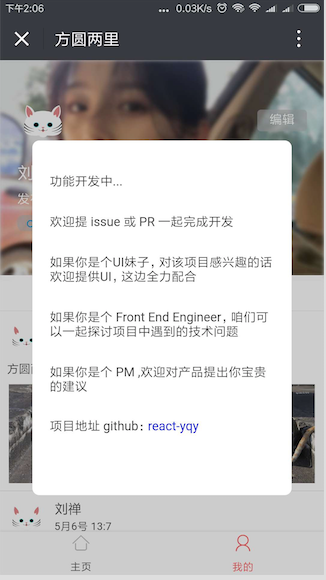

# react-yqy

## 技术栈：

react + redux + webpack + react-router v4 + ES6/7/8 + immutable + antd-mobile

## 运行项目

```javascript
 git clone https://github.com/ZengTianShengZ/react-yqy.git

 cd react-yqy

 npm i
  
 npm start

 npm run build （发布）
```
## 说明

> 本项目主要用于 react 的学习，但有意将它做成一款产品，算是技术的一种产出，也能在学习中有成就感。

> 这是一款什么样的产品呢，这是一款基于地理位置有社交属性的产品，具有发动态，动态评论等功能，
围绕用户推送两公里内的动态内容。产品的主旨是【方圆两公里，分享身边事】，区别于微信的朋友圈，
该产品用户群体定位在泛熟群体，用户可以在生活区或工作区分享或了解身边的人和事。当然如果你对产品
有更好的想法或想象，可以敲起你的键盘，咱们一起来实现它吧。

## 目标功能
- [x] 手机号码登录功能
- [ ] 动态发布功能
  - [x] 文字编辑
  - [x] 图片选择
  - [ ] 地理位置显示和选择
- [ ] 首页列表基于用户方圆两公里动态筛选展示
- [x] 动态详情页
- [ ] 动态评论
  - [x] 评论
  - [x] 回复评论
  - [ ] 删除评论
- [ ] 用户信息
  - [x] 用户发布的动态列表
  - [ ] 用户评论过得动态列表
  - [ ] 用户信息编辑

## 目录结构
本项目构建工具采用的是 [create-react-app](https://github.com/facebook/create-react-app) 
```
  react-yqy
  |
  |-- src                      //源码目录
  |    |-- api                 // 数据接口
  |    |-- component           // 组件
  |    |-- pages               //页面
         | -- home             //主页
         | -- me               //用户页
         | -- detail           //动态详情页
         | -- pubilsh          //动态发布页
         | -- login            //登录页
  |    |-- router              //主路由
  |    |-- store               // 状态管理
  |    |-- style               //全局样式
  |    |-- utils               //工具方法
  |    |-- App.js              //父组件
  |    |-- index.js            //js 入口文件

```

## 项目部分页面预览









